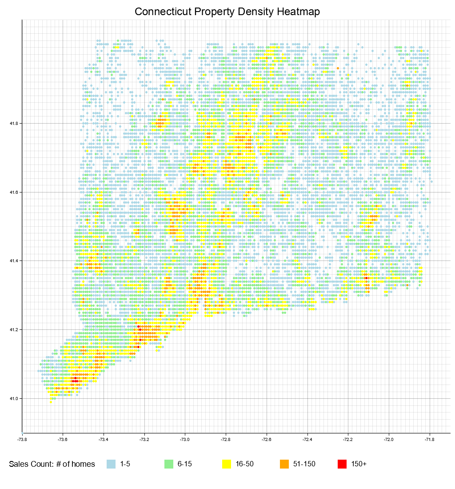

# 210 Final Project Writeup: Real Estate Insights in the state of Conneticut 

## A. Project Overview

### Goal
This project aims to help users better understand trends in the a given real estate market by visualizing property sale patterns and identifying high-opportunity areas. 

Specifically, the program:
- Generates a geographic heatmap of Connecticut home sales
- Identifies towns with increasing home values  
- Finds undervalued properties that resemble high-end homes in the same area *(flipper properties)*

### Dataset
The data was gathered from [catalog.data.gov](https://catalog.data.gov/dataset/real-estate-sales-2001-2018) 

The original dataset contains over **1 million real estate transaction records** from Connecticut, including sales prices, assessed values, property types, and geographic coordinates. It was preprocessed to retain only records with valid coordinates.

*The original CSV is too large to host on GitHub a shunken file is provided and used: [shrunk_split_data.csv](shrunk_split_data.csv)*

---
## B. Data Processing

### How data is loaded into Rust 
The dataset is read using the `csv` crate with headers enabled. The `parse_csv()` function handles reading each row and converting it into a `Property` struct.

I used [`rayon`](https://docs.rs/rayon/latest/rayon/index.html) for parallel processing via `.par_bridge()` to speed up parsing on my original very large dataset.

### Cleaning/Preprocessing

The original dataset had quite a bit of hit or miss data. I created and used a seperate rust program to clean, and split only the data that contained the lat/lon cordinates. Within the program only the following cleaning is done.:

- Only properties with valid coordinates and positive sale amounts are processed (invalid data is skipped)
- Location coordinates are binned into 0.01-degree grid cells for visualization

---
## C. Code Structure

### Modules & Purpose
- `main.rs`: Organizes execution
- `parser.rs`: Loads and parses the CSV
- `property.rs`: Defines the `Property` struct
- `heatmap.rs`: Generates a CSV of average sales ratios per grid cell
- `heatmap_draw.rs`: Generates a PNG heatmap visualization using [`plotters`](https://docs.rs/plotters/latest/plotters/)
- `insights.rs`: Prints statistics, identifies high-growth towns and flippable properties

### Main Struct
**`Property`**

 Holds all relevant attributes needed for analysis, visualization, and filtering, every row of the CSV file is parsed into one Property instance, and nearly all logic operates over a `Vec<Property>`. It represents one row of the CSV and includes all the fields within the CSV.

- Inputs: Each field is extracted from a row of the CSV file using `record.get()` and it is parsed into the appropriate Rust type
- Outputs: The struct itself is passed between modules to do nearly everything in the program

### Key Functions
- `pub fn parse_csv(filename: &str) -> Vec<Property>`: Loads all valid properties from a file. Uses `rayon::par_bridge()`.
- `generate_heatmap()` (in `heatmap.rs`):
    - Bins coordinates and averages sales ratios per cell.
    - Writes to a CSV with `lon,lat,avg_ratio`.
- `draw_heatmap()` (in `heatmap_draw.rs`):
    - Visualizes grid-based property counts using Plotters.
- `find_rising_towns()`:
    - Calculates percent increase in median sale price per town.
- `find_flipper_properties()`:
    - Finds undervalued homes matching the characteristics of high-end homes in the same town/type.

---

## D. Tests

 *Vital program functions have tests*

### `cargo test` output:
```
running 4 tests
test property::test_property_creation ... ok
test insights::tests::test_summary_statistics_runs ... ok
test heatmap::tests::test_generate_heatmap_content ... ok
test parser::test_parse_csv_with_mock_data ... ok

test result: ok. 4 passed; 0 failed; 0 ignored; 0 measured; 0 filtered out; finished in 0.01s
```

### Breakdown
- `test_property_creation`: Validates basic struct creation, vital for program functionality 
- `test_summary_statistics_runs`: Confirms that summary stats don’t crash on input and make successful output/run correct calculations using test data
- `test_generate_heatmap_content`: Checks that a file is created with correct values and correct calculations using test data, ensures calculations are correct and that a readable CSV is being properly generated 
- `test_parse_csv_with_mock_data`: Ensures a mock CSV loads correctly, important for the program to function properly 

---
## E. Results

- Program outputs:
    - Text printed to terminal
    - [heatmap.csv ](ct_heatmap.csv)

ct_heatmap.png: 



Terminal output:
```
Loaded 112387 properties.
  Summary Statistics:
  Mean Sale Amount: $549076.54
  Median Sale Amount: $309900.00
  Mode Sale Amount: $250000.00
  Std Dev: $2537184.85
Heatmap CSV saved to ct_heatmap.csv
Heatmap image saved to ct_heatmap.png
Top 5 Towns Predicted to Rise (Median Sale Growth):
  Union: 138.5% median price increase
  Salem: 86.1% median price increase
  Woodbridge: 73.0% median price increase
  Pomfret: 51.5% median price increase
  Willington: 43.9% median price increase
Flipper Property Candidates (Low Price, High-End Traits):
  15 CENTER ST in New London: $285000 (Assessed $117390, Ratio 0.41)
  261 GARDNER AVE in New London: $268000 (Assessed $116060, Ratio 0.43)
  E55 RIVERVIEW CROSSING in Branford: $177000 (Assessed $74900, Ratio 0.42)
  1342 NORTH RD in Groton: $217000 (Assessed $107940, Ratio 0.50)
  98 ASPETUCK VILLAGE in New Milford: $82000 (Assessed $57960, Ratio 0.71)
Program completed in 1.23s
```

### Interpretation in project context
- The summary statistics show a highly skewed distribution of sale amounts, with a few extremely high-value properties raising the average. The median and mode provide a more realistic view of typical transactions, centered around $250,000-$310,000.

- The heatmap visualization reflects expected patterns, with higher transaction density around major urban areas like New Haven, Stamford, and Hartford. This suggests consistent activity in population centers, which aligns with known market behavior.

- The list of towns with rising median prices points to areas where prices may be trending upward. These aren't necessarily the most expensive towns, but ones with significant percentage growth. Possibily due to increased demand in those markets.

- The flippable property section highlights homes that are significantly undervalued compared to others of the same property type in the same town. These could represent real opportunities for investors, or at least serve as starting points for further analysis.

---

## F. Usage Instructions

### Run Locally:
```bash
cargo build --release
cargo run --release
```

### Prerequisites:
- Rust & IDE of choice
- File named [shrunk_split_data.csv](shrunk_split_data.csv) in project root (CSV can be changed in main.rs)
- [Cargo.toml](Cargo.toml) with relevent dependencies 

### Runtime:
- ~2 seconds *with included file `shrunk_split_data.csv`*
- ~30 seconds *with ~1M entries*
- Output files are saved in the same directory
- 2 Files are generated, ct_heatmap.png & ct_heatmap.csv
    - *They will be overwritten each time the progam is ran*

---

## G. AI-Assistance Disclosure & Other Citations

Chatgpt was used for:
- Debugging 
- Revising test functions
- Simplifying logic and aiding in understanding documentation
- Help learn git and uploading project to github 


### External Documentation Referenced
- [`rayon::par_bridge`](https://docs.rs/rayon/latest/rayon/iter/trait.ParallelBridge.html)
- [`plotters` crate](https://docs.rs/plotters/0.3.7/plotters/index.html)
- [`csv` crate](https://docs.rs/csv/latest/csv/index.html)
- Various Rust documentation

---
---

```css         
                    ________________________________________
                   |                                        |
                   |   Thank you for reviewing my project!  |
                   |    And for a fun semester in 210       |
      ._     _.   -|           #I_SURVIVED_DS210            |
      |\\___//|    |________________________________________|
      |=O   O=|    
      \=._Y_.=/    
       )     (      
      /       \  ((
      |       |   ))
     /| |   | |\_//
     \| |._.| |/-`
      '"'   '"'
```


